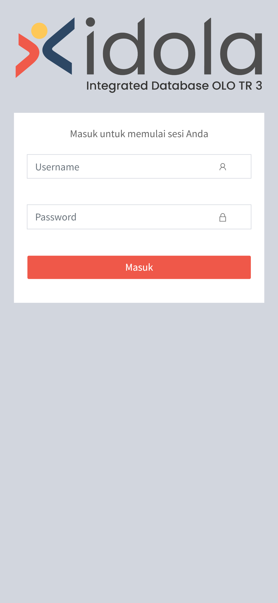
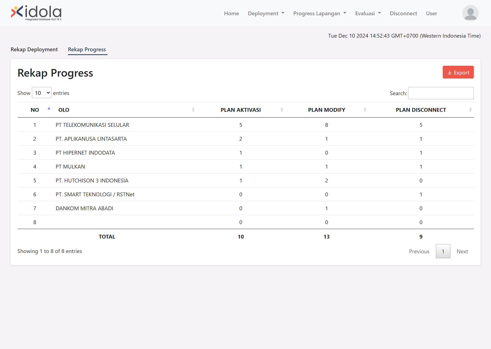
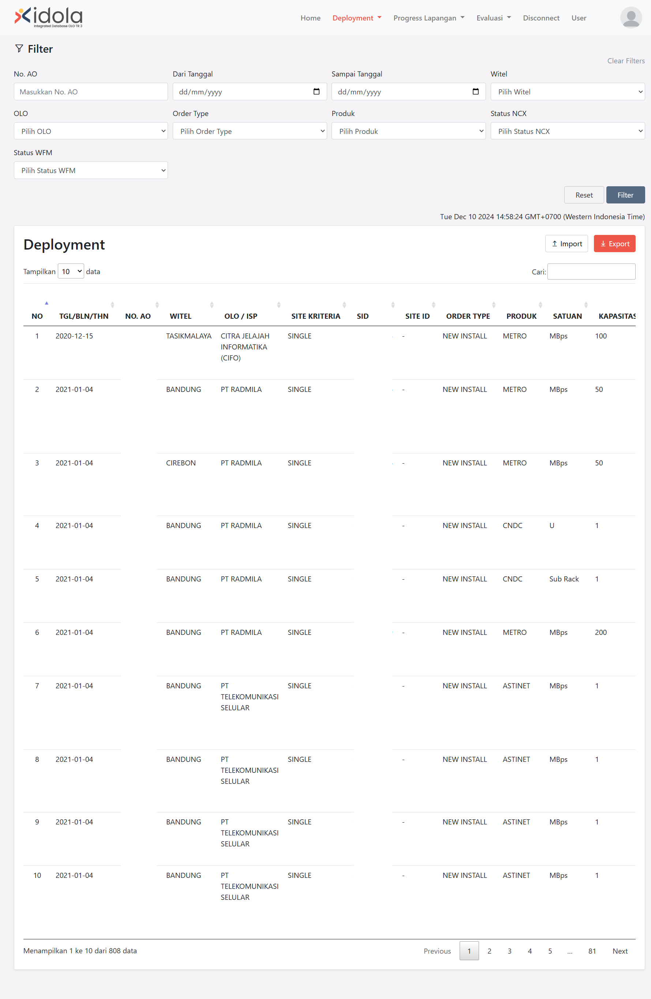
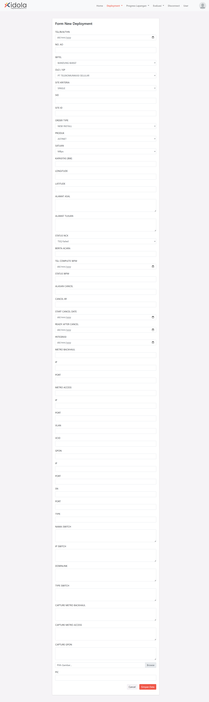
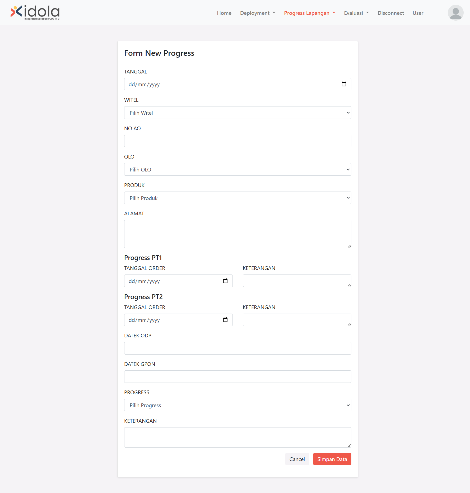
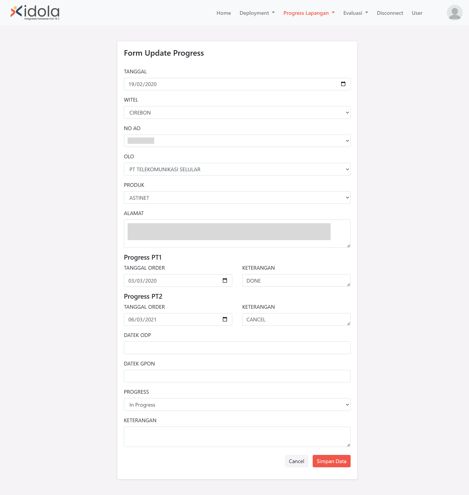
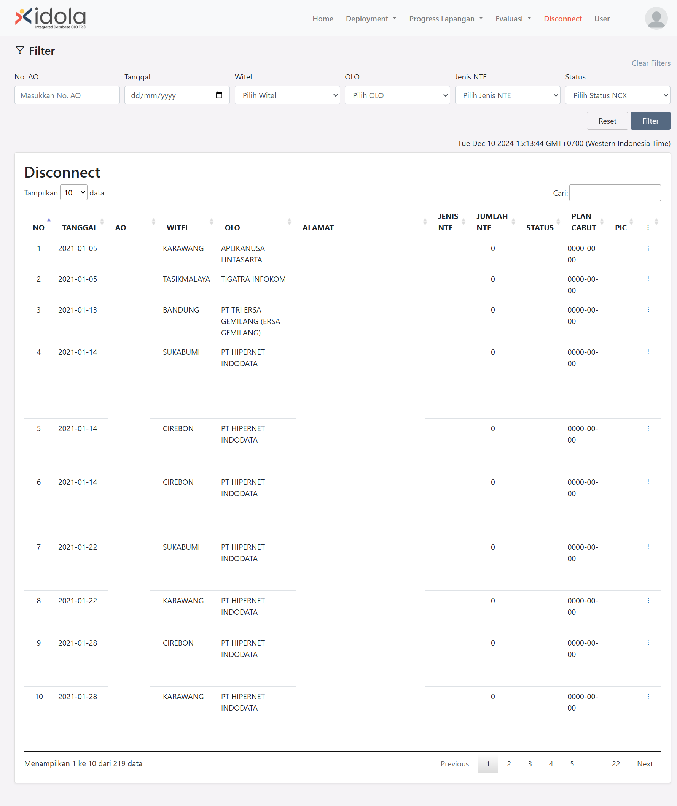
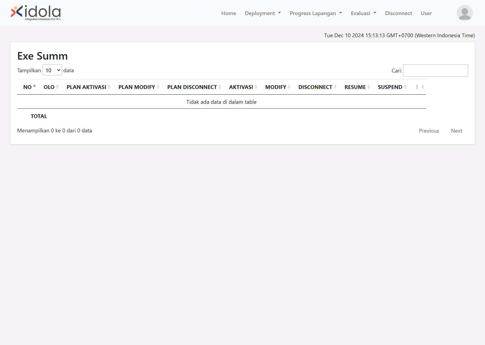

# Web-based Wholesale Customer Technical Data Management Information System - Telkom Intership | UNIKOM

[**Dokumentasi Bahasa Indonesia (Indonesian Documentation)**](/docs/id/README.md)

This repository is dedicated to the internship that was held from **September 2021** to **December 2021** at the Telkom Indonesia Graha Merah Putih Bandung company.

**Web-based Wholesale Customer Technical Data Management Information System** is an application based on an internship at PT Telkom Indonesia Graha Merah Putih, Bandung City, West Java, Indonesia. Built using the PHP Programming language with the Laravel framework. According to the Publication Agreement Certificate, the original data/database is confidential and protected under the copyright of PT Telkom Indonesia Graha Merah Putih Bandung. Therefore, for the purpose of the application demo, we have substituted the original data with modified (dummy) data that can be publicly displayed.

## Features

The features contained in this web application are as follows:

-   Role-based login authentication (administrator, editor, and user view)
-   CRUD (create, read, update, and delete) operations
-   Excel file import and export
-   Data filtering according to specific criteria
-   Administrator-only user data management

## Team

-   Bagus Perdana Yusuf (Front-end Developer, Back-end Developer)
-   Raden Fachrul Ramzy Muhammad (Front-end Developer, Back-end Developer)
-   Robi Nurhidayat (Back-end Developer, Front-end Developer)

### Tasks & Responsibilities (Bagus)

-   Worked collaboratively with a team of 3 people in building a Data Management Information System website that helps facilitate employees in the process of managing customer technical data by utilizing HTML, CSS, JavaScript and PHP Laravel in the team.
-   Designed software in accordance with the needs of the company and reported the progress of the software being built weekly.
-   Conducted Create, Read, Update, and Delete (CRUD) operations on the progres lapangan (field progress) page and help create user authentication.
-   Created a data filtering feature based on the criteria specified on the deployment, progres lapangan (field progress), and disconnect pages.
-   Translated the wireframe design into program code to create the website application's user interface and created a mini real-time clock function using JavaScript.
-   Conceptualized the initial web application design through wireframes using Balsamiq Cloud.

### Tasks & Responsibilities (Raden Fachrul)

-   Built a website-based information system to facilitate the management of customer technical data by working with teammates to design and develop applications together.
-   Designed software in accordance with the needs of the company and reported the progress of the software being built weekly.
-   Created a role-based login authentication feature consisting of three roles (administrator, editor, user view) and designed the user interface for the login page.
-   Created user management features for administrators, including the ability to create user data, update user data, and delete user data.
-   Translated the wireframe design into program code to create the website application's user interface.
-   Conceptualized the initial web application design through wireframes using Balsamiq Cloud.

### Tasks & Responsibilities (Robi)

-   Built a website-based information system to facilitate the management of customer technical data by working with teammates to design and develop applications together.
-   Designed software in accordance with the needs of the company and reported the progress of the software being built weekly.
-   Created features to export data into an Excel file, as well as import data from an Excel file into a database.
-   Performed Create, Read, Update, and Delete (CRUD) operations on deployment, recap, disconnect, and exe summ pages.
-   Transformed existing data from Excel into a structured database schema and model to minimize redundancy and boost efficiency.
-   Translated the wireframe design into program code to create the website application's user interface.
-   Conceptualized the initial web application design through wireframes using Balsamiq Cloud.

## Preview

> [!IMPORTANT]  
> Certain data, like addresses, AO, and SID, cannot be shown due to their sensitivity to the company. The data present on the Data Management page is solely for application testing purposes and therefore does not need to be censored.

### Login Page


### Login Page (Mobile)



### Rekap Deployment Page


### Rekap Progress Page



### WFM Deployment Page



### WFM Deployment - Create Form



### WFM page - Import feature


### Progress Lapangan Page


### Progress Lapangan - Create Form



### Progress Lapangan - Edit Form



### Disconnect



### Exe Summ



### User Management Page


## Technology stack & Tools

**This program needs:**

| Tech Stack & Tools              | Version |
| ------------------------------- | ------- |
| Bootstrap CSS                   | 4.0+    |
| Composer                        | 2.20+   |
| DataTables                      | 1.11+   |
| PHP                             | 7.4.20+ |
| Laravel                         | 8.54+   |
| Line Awesome                    | 1.0.2+  |
| Sweet Alert                     | 2.0+    |
| Visual Studio Code              | Latest  |
| XAMP (PHP, MySQL, Apache/Nginx) | 7.4+    |
| Balsamic Cloud                  | -       |
| Draw.io                         | -       |

## Setup

### Customization `.env`

1. Copy .env-example
2. Rename .env-example copy to .env
3. Modify the `.env` content

### Install Dependencies

Open terminal, type the following commands:

```shell
composer update
npm install
```

### Run Program

Open terminal, type the following commands:

```shell
php artisan key:generate
php artisan serve
```
