# Sistem Informasi Pengelolaan Data Teknis Pelanggan Wholesale - Kerja Praktek | UNIKOM

[**English Documentation (Dokumentasi Bahasa Inggris)**](../../README.md)

Repositori ini dikhususkan untuk kerja praktek yang dilaksanakan pada bulan **September 2021** hingga **Desember 2021** di perusahaan Telkom Indonesia Graha Merah Putih Bandung.

**Sistem Informasi Pengelolaan Pelanggan Data Teknis Pelanggan Wholesale Berbasis Web** adalah aplikasi hasil Kerja Praktek di Perusahaan PT Telkom Indonesia Graha Merah Putih Bandung. Dibangun menggunakan bahasa Pemrograman PHP dengan framework Laravel. Berdasarkan Surat Keterangan Persetujuan Publikasi, maka data/database orisinal tidak dapat ditampilkan karena bersifat rahasia dan milik hak cipta perusahaan PT Telkom Indonesia Graha Merah Putih Bandung. Maka untuk kebutuhan demo aplikasi, kami mengganti data orisinal dengan data yang telah diubah sedemikian rupa (dummy) yang dapat diperlihatkan ke khalayak publik.

## Features

Fitur-fitur yang terdapat pada aplikasi web ini adalah sebagai berikut:

-   Autentikasi login berbasis peran (administrator, editor, & user view)
-   Operasi Create, Read, Update, & Delete (CRUD)
-   Impor berkas dari Excel ke dalam bentuk basis data ekspor berkas dari basis data menjadi berkas Excel
-   Penyaringan data berdasarkan kriteria tertentu
-   Pengelolaan data pengguna (khusus administrator)

## Team

-   Bagus Perdana Yusuf (Front-end Developer, Back-end Developer)
-   Raden Fachrul Ramzy Muhammad (Front-end Developer, Back-end Developer)
-   Robi Nurhidayat (Back-end Developer, Front-end Developer)

### Tasks & Responsibilities (Bagus)

-   Bekerja sama dengan sebuah tim beranggotakan 3 orang dalam membangun website Sistem Informasi Manajemen Data yang membantu memudahkan pegawai dalam proses pengelolaan data teknis pelanggan menggunakan HTML, CSS, JavaScript dan PHP Laravel dalam tim.
-   Merancang perangkat lunak yang sesuai dengan kebutuhan perusahaan dan melaporkan hasil pengerjaan perangkat lunak yang sedang dibangun setiap minggu.
-   Melakukan operasi Create, Read, Update, dan Delete (CRUD) pada halaman progress lapangan dan membantu membuat autentikasi pengguna.
-   Membuat fitur penyaringan data (filter) berdasarkan kriteria yang ditentukan pada halaman deployment, progress lapangan, disconnect.
-   Menerjemahkan rancangan kerangka dasar (wireframe) menjadi kode program untuk menghasilkan tampilan antarmuka pengguna aplikasi situs web dan membuat fitur mini penunjuk jam real-time dengan JavaScript.
-   Membuat konsep desain awal aplikasi web melalui wireframe menggunakan Balsamiq Cloud

### Tasks & Responsibilities (Raden Fachrul)

-   Membangun sistem informasi berbasis website untuk mempermudah pengelolaan data teknis pelanggan dengan bekerjasama bersama rekan tim untuk merancang dan mengembangkan aplikasi bersama.
-   Merancang perangkat lunak yang sesuai dengan kebutuhan perusahaan dan melaporkan hasil pengerjaan perangkat lunak yang sedang dibangun setiap minggu.
-   Membuat fitur autentikasi login berbasis peran yang terdiri dari tiga peran (administrator, editor, user view) serta mendesain tampilan antarmuka pengguna untuk halaman login.
-   Membuat fitur pengelolaan pengguna untuk administrator seperti menambahkan data pengguna, mengubah data pengguna, serta menghapus data pengguna.
-   Menerjemahkan rancangan kerangka dasar (wireframe) menjadi kode program untuk menghasilkan tampilan antarmuka pengguna aplikasi situs web.
-   Membuat konsep desain awal aplikasi web melalui wireframe menggunakan Balsamiq Cloud

### Tasks & Responsibilities (Robi)

-   Membangun sistem informasi berbasis website untuk mempermudah pengelolaan data teknis pelanggan dengan bekerjasama bersama rekan tim untuk merancang dan mengembangkan aplikasi bersama.
-   Merancang perangkat lunak yang sesuai dengan kebutuhan perusahaan dan melaporkan hasil pengerjaan perangkat lunak yang sedang dibangun setiap minggu.
-   Membuat fitur untuk mengekspor data ke dalam file Excel, serta mengimpor data dari file Excel ke dalam basis data.
-   Melakukan operasi Create, Read, Update, dan Delete (CRUD) pada halaman deployment, rekap, disconnect, dan exe summ.
-   Mengkonversi data yang ada di Excel ke dalam bentuk skema dan model database yang terstruktur untuk meminimalisir redundansi dan meningkatkan efisiensi.
-   Menerjemahkan rancangan kerangka dasar (wireframe) menjadi kode program untuk menghasilkan tampilan antarmuka pengguna aplikasi situs web.
-   Membuat konsep desain awal aplikasi web melalui wireframe menggunakan Balsamiq Cloud

## Preview

> [!IMPORTANT]  
> Beberapa data seperti alamat, AO dan SID tidak dapat ditampilkan karena data-data tersebut sensitif bagi perusahaan. Untuk Data yang terdapat pada halaman Data Management hanya data user untuk pengujian aplikasi, sehingga tidak perlu disensor.

### Login Page

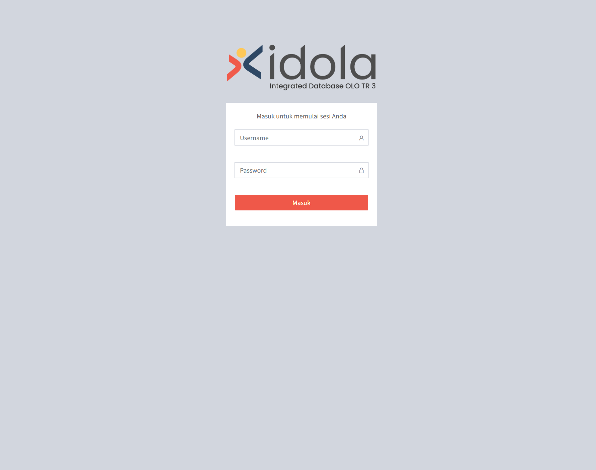

### Login Page (Mobile)

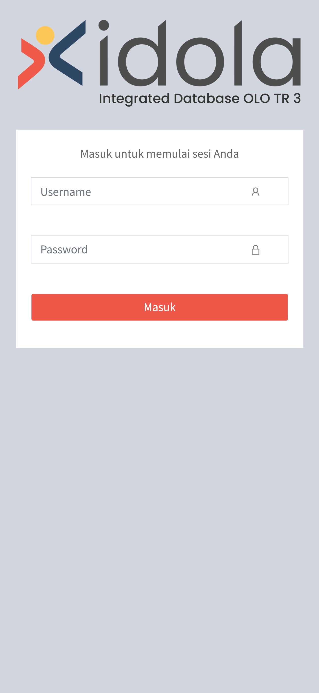

### Rekap Deployment Page

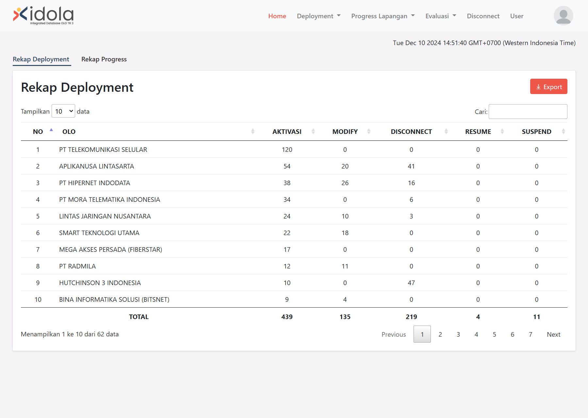

### Rekap Progress Page

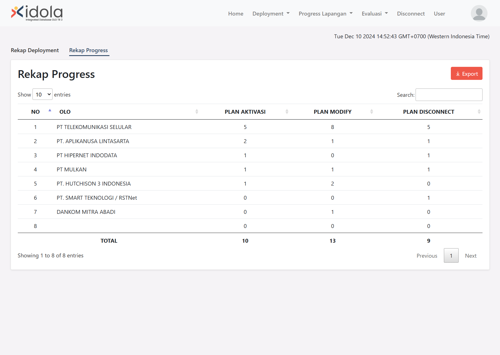

### WFM Deployment Page

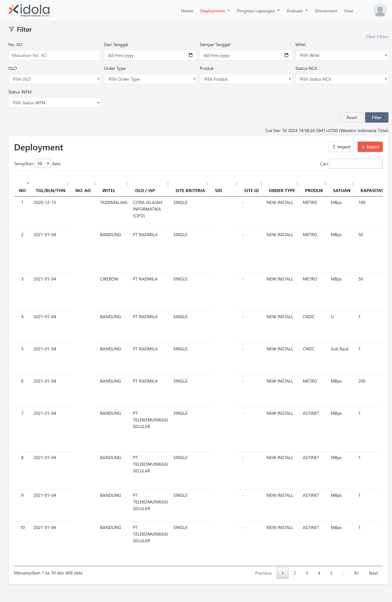

### WFM Deployment - Create Form

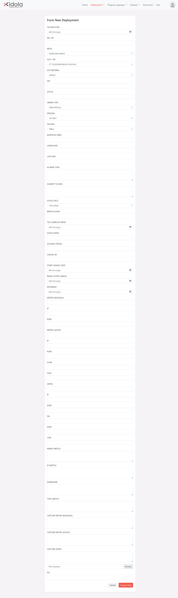

### WFM page - Import feature

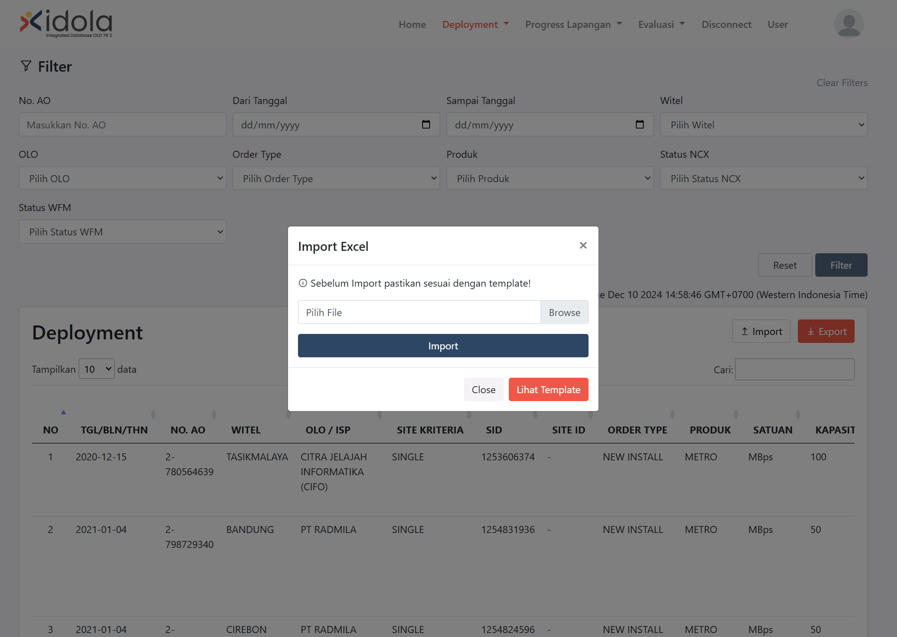

### Progress Lapangan Page

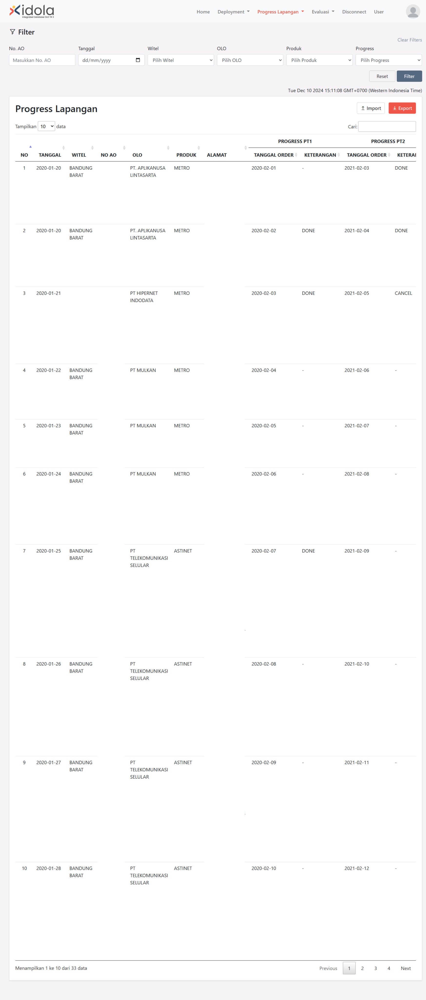

### Progress Lapangan - Create Form

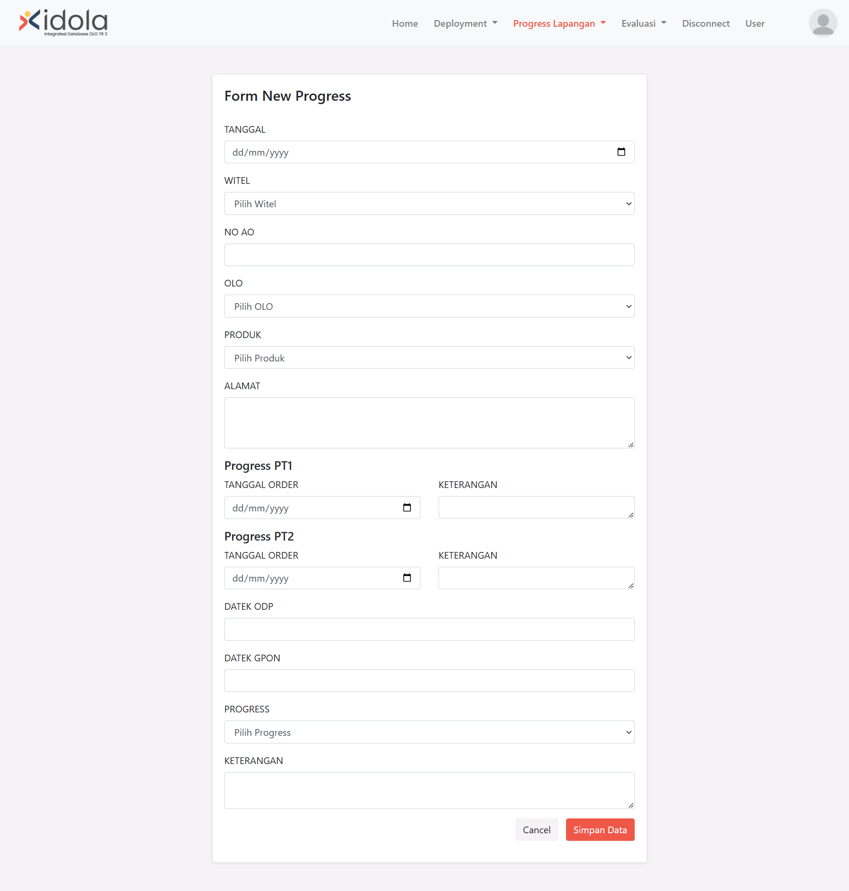

### Progress Lapangan - Edit Form

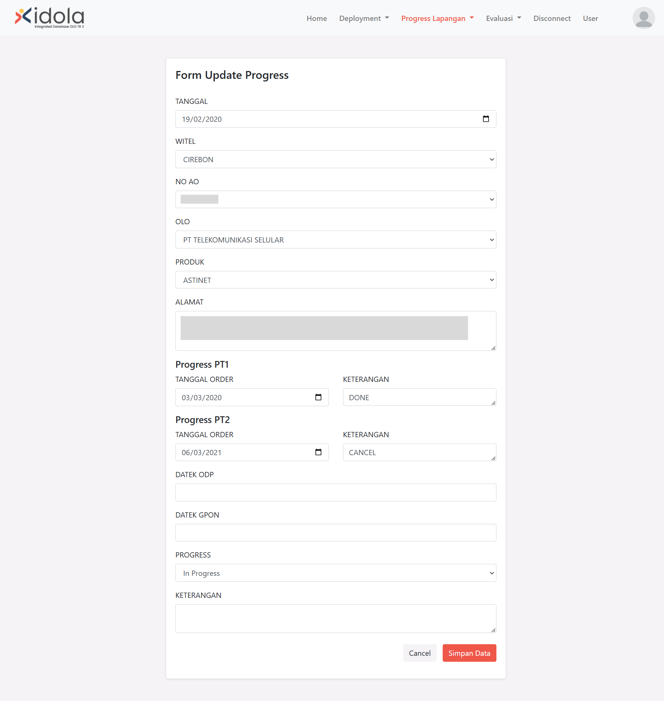

### Disconnect

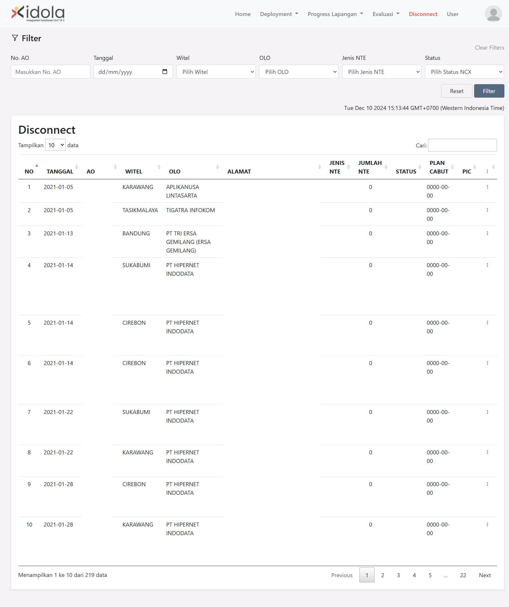

### Exe Summ

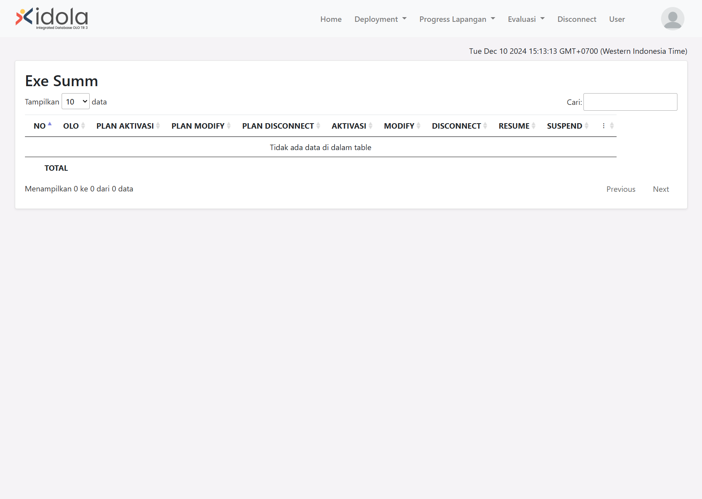

### User Management Page

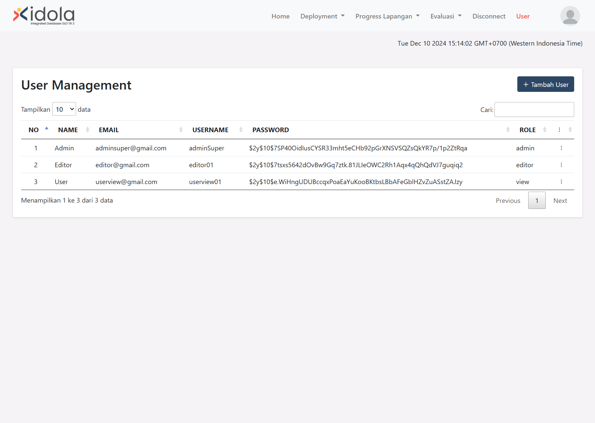

## Technology stack & Tools

**Program ini membutuhkan:**

| Tech Stack & Tools              | Version |
| ------------------------------- | ------- |
| Bootstrap CSS                   | 4.0+    |
| Composer                        | 2.20+   |
| DataTables                      | 1.11+   |
| PHP                             | 7.4.20+ |
| Laravel                         | 8.54+   |
| Line Awesome                    | 1.0.2+  |
| Sweet Alert                     | 2.0+    |
| Visual Studio Code              | Latest  |
| XAMP (PHP, MySQL, Apache/Nginx) | 7.4+    |
| Balsamic Cloud                  | -       |
| Draw.io                         | -       |

## Setup

### Kustomisasi `.env`

1. Salin .env-example
2. Ubah nama .env-example copy menjadi .env
3. Ubah isi `.env`nya

### Install Dependencies

Buka terminal, ketikkan perintah:

```shell
composer update
npm install
```

### Run Program

Buka terminal, ketikkan perintah:

```shell
php artisan key:generate
php artisan serve
```
